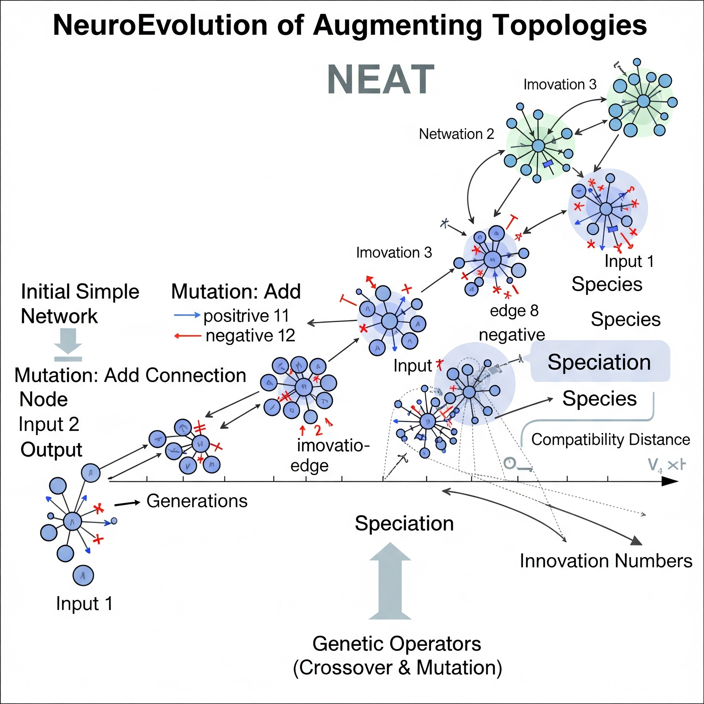
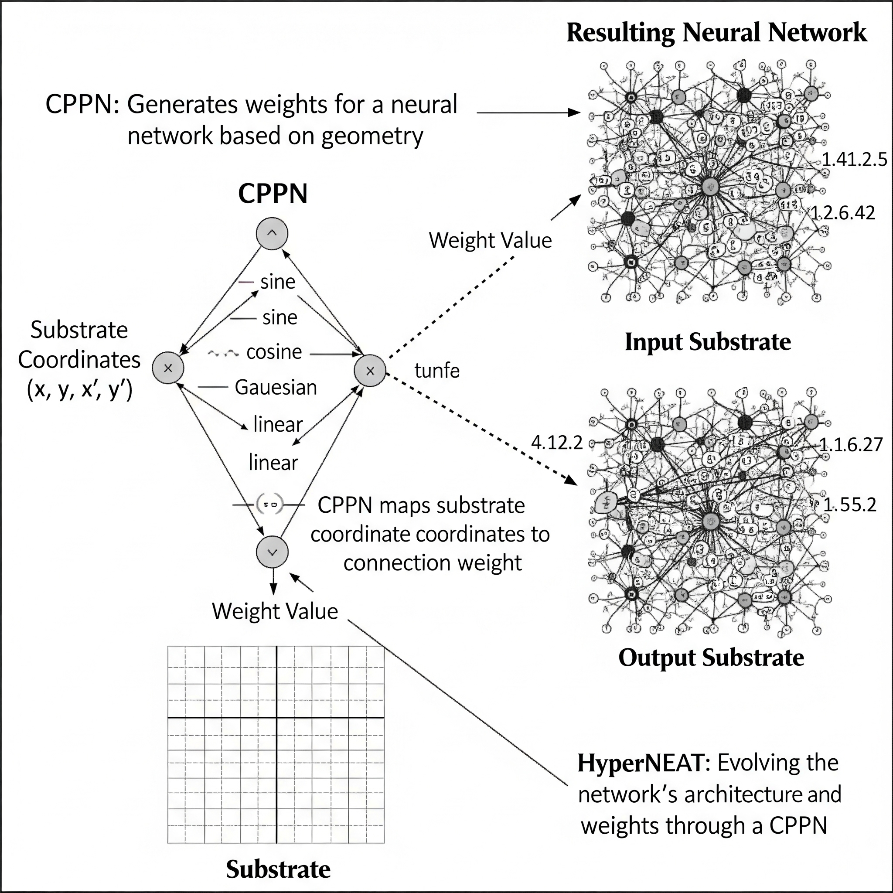

# Neuro-Evolution Review

 

Live site: [https://pzarzycki.github.io/neuro-evolution-review/](https://pzarzycki.github.io/neuro-evolution-review/)

## Overview

This project is a concise, visitor-focused review of influential research in neuro-evolution. The site collects important papers, links to code when available, and provides short summaries to help readers locate primary sources and notable implementations quickly.

## What you'll find

- Curated foundational and recent papers across neuro-evolution and hybrid methods.
- Clear links to original sources (arXiv, DOI, publisher pages) and canonical code repositories where available.
- Short summaries and a searchable gallery to help you scan the literature efficiently.

## Visuals

Below are concept images illustrating NEAT and HyperNEAT placed side-by-side for a quick visual cue.

| NEAT (direct encoding) | HyperNEAT (indirect / CPPN) |
|---:|:---|
|  |  |

## Feedback

If you have suggestions or spot any errors, please open an issue on this repository.

